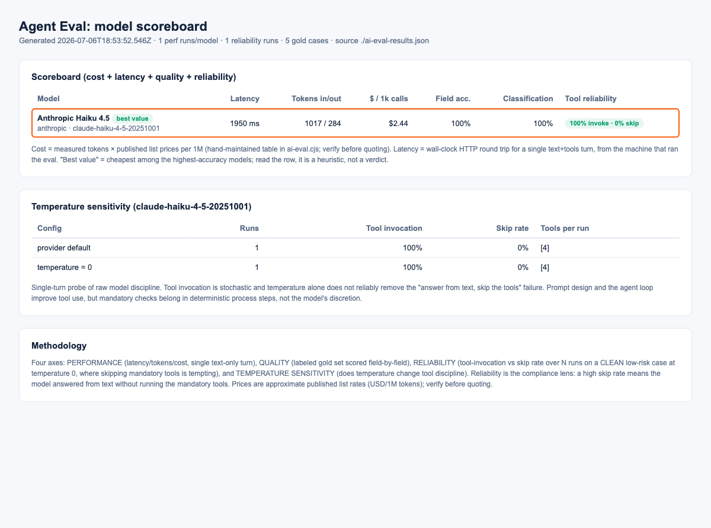

# camunda-agent-eval: plugin guide

A Claude Code plugin for Camunda Solutions Engineers that adds a defensible, four-axis LLM model
eval (with a live dashboard) to **any Camunda project using AI Agent Tasks or AI Agent ad-hoc
sub-processes**, whatever LLM provider the project runs on.

This is the public guide. The plugin code lives in Camunda's consulting GitHub org at
[camunda-consulting/camunda-agent-eval](https://github.com/camunda-consulting/camunda-agent-eval)
(not public): anyone with a Camunda GitHub account can use it directly, no access request needed.



## What you get

| Axis | Question it answers |
| --- | --- |
| Performance | latency, tokens in/out, estimated USD cost per 1k calls |
| Quality | field-by-field accuracy against a labeled gold set |
| Reliability | did the model actually invoke the mandatory tools, or answer from text and skip them (the compliance argument) |
| Temperature sensitivity | does temperature=0 actually fix tool-skipping (spoiler: not reliably) |

The outcome for your demo or PoV: instead of asserting a model choice, you show a scoreboard,
for example "this model matches the premium model's accuracy on our task at a fraction of the
cost, and here is its tool-skip rate at temperature 0".

## How it works

You do not hand-configure the eval. The plugin's skill:

1. **Scans your repo**: finds the AI Agent connectors in your BPMN and extracts the provider,
   model, system prompt, and tool definitions. The eval becomes YOUR agent's task automatically.
2. **Interviews you** for what it cannot infer: which models to compare, which API keys you have
   (or point it at your `.env`), and where the dashboard should live.
3. **Drafts your gold set** from your demo scenarios or test fixtures (or synthesizes cases from
   the agent's input schema) and asks you to confirm the expected answers. You sign off on the
   answer key; the tool never grades itself against its own guesses.
4. **Generates** the harness, gold set, API route, and dashboard (React component if your frontend
   is React, a standalone HTML page for anything else), then **runs it** (cheap single-model smoke
   first) and verifies the dashboard renders.

## Provider support

OpenAI-compatible endpoints (OpenAI, Cohere, Groq, Ollama, OpenRouter, vLLM), Anthropic,
Azure OpenAI, Google Gemini, and AWS Bedrock. Models with missing keys are skipped gracefully.

## Install (Camunda GitHub account required)

```
/plugin marketplace add camunda-consulting/camunda-agent-eval
/plugin install camunda-agent-eval@camunda-agent-eval
```

Then open Claude Code in your Camunda project and say:

> add a model eval to this project

If the marketplace add fails with a 404, your git credentials are not authorized for the
camunda-consulting org yet: run `gh auth login` (or `gh auth refresh`) and approve the
SSO prompt for camunda-consulting in the browser.

## Contribute

- **Improvements**: push a branch and open a pull request on
  [camunda-consulting/camunda-agent-eval](https://github.com/camunda-consulting/camunda-agent-eval)
  (please do not push to master directly).
- **Ideas and bug reports**: open an issue on that repo; if you are outside the Camunda org,
  open it here instead.

## Good to know

- Cost numbers come from measured tokens multiplied by a hand-maintained price table; verify rates
  before quoting a client.
- Latency is the wall-clock HTTP round trip for a single text+tools turn from your machine; for
  per-instance production numbers, use Operate's flow node timestamps and the agent's
  `context.metrics.tokenUsage` variable.
- Re-run the eval after any prompt or model change; it doubles as a regression check.
